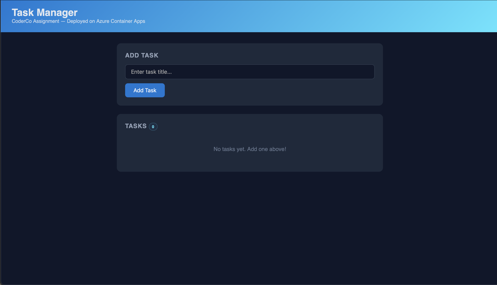
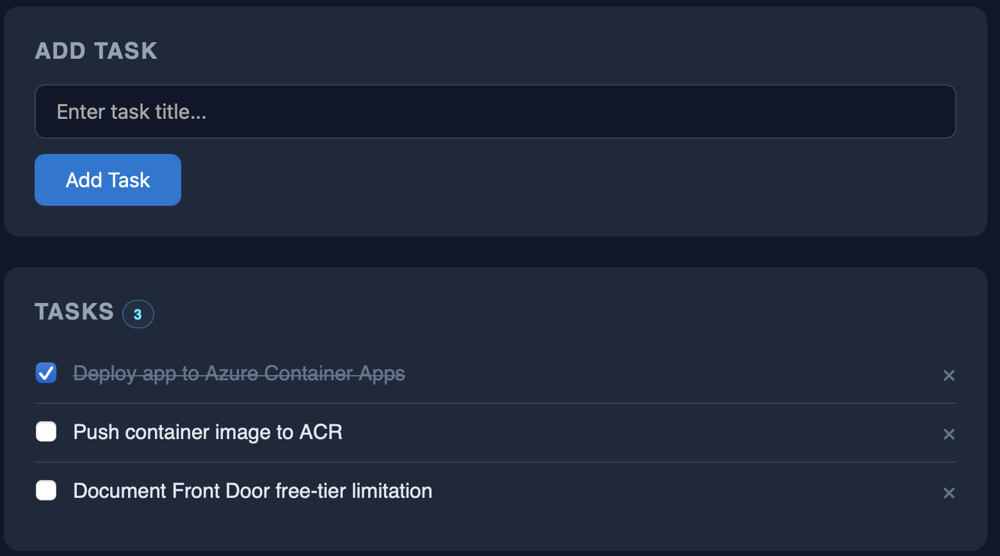
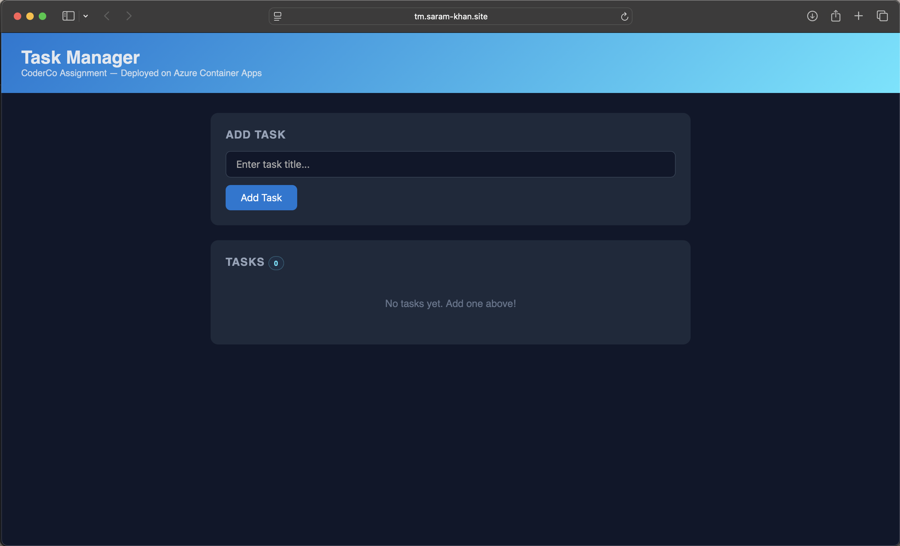
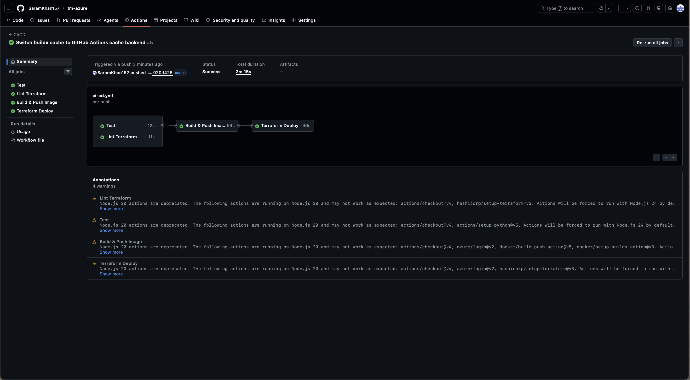
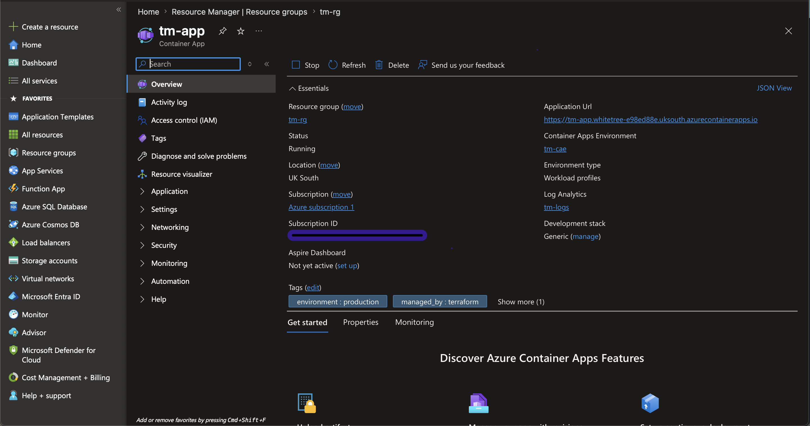
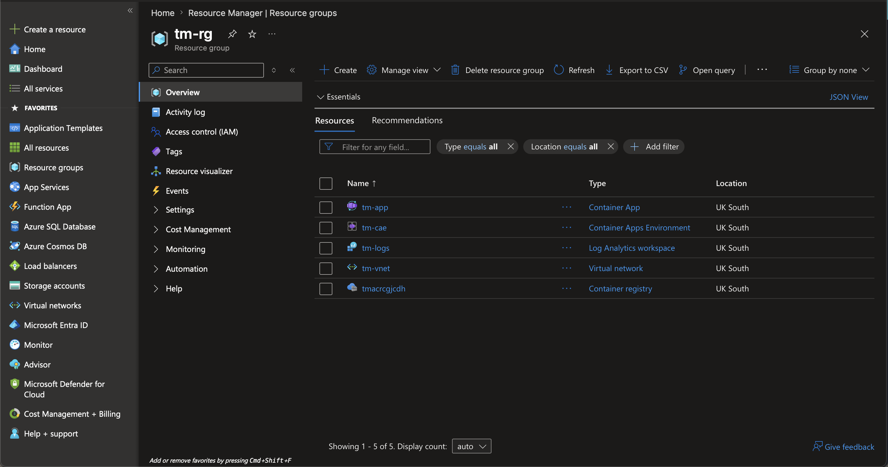
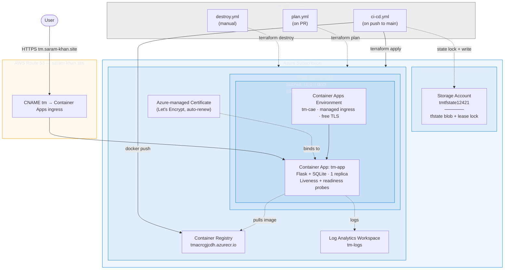

# Task Manager on Azure

A small Flask task-manager app I containerised and deployed to Azure as part of
the CoderCo cloud assignment. Everything — the registry, the container runtime,
the networking, the TLS cert, the rollout pipeline — is provisioned with
Terraform and deployed from GitHub Actions.

**Live:** https://tm.saram-khan.site

> The deployment runs on a Free Trial subscription so I'll tear it down once
> this is marked. The URL above will stop resolving when I do.

---

## What it looks like

### The app

| Empty state | With a few tasks |
|---|---|
|  |  |

Served over the custom domain with a managed Let's Encrypt cert:



### The plumbing behind it

CI/CD pipeline running end-to-end on every push to `main`:



Container App live in the Azure portal — note the
`managed_by: terraform` tag, that's how I keep track of what's mine:



The full resource group Terraform created:



---

## Architecture



See [docs/architecture.md](docs/architecture.md) for a deeper breakdown.

### Stack

| Layer | Tech |
|---|---|
| App | Python 3.12 · Flask · SQLite |
| Container | Multi-arch image, non-root user, Trivy-scanned in CI |
| Hosting | Azure Container Apps (Consumption profile) |
| Registry | Azure Container Registry (Basic) |
| TLS | Azure-managed Let's Encrypt cert, auto-renewed |
| DNS | AWS Route 53 (where my domain already lives) |
| IaC | Terraform 1.9, azurerm 3.117, remote backend in Azure Blob |
| CI/CD | GitHub Actions with OIDC federated credentials (no stored secrets) |
| Security | Trivy image scan blocks HIGH/CRITICAL CVEs on push |

---

## Run locally

```bash
cd app
python3 -m venv .venv && source .venv/bin/activate
pip install -r requirements.txt
python3 app.py
# → http://localhost:3000
```

### API

```bash
curl -X POST -H "Content-Type: application/json" \
  -d '{"title":"Ship it"}' http://localhost:3000/tasks

curl http://localhost:3000/tasks
curl -X PUT -H "Content-Type: application/json" \
  -d '{"completed":true}' http://localhost:3000/tasks/1
curl -X DELETE http://localhost:3000/tasks/1
```

### Tests

```bash
cd app
pip install pytest
pytest -v
```

---

## Deploying it yourself

Set up once:

```bash
# 1. Log in
az login

# 2. Register providers (fresh subscriptions need this)
for ns in Microsoft.Storage Microsoft.ContainerRegistry Microsoft.App \
          Microsoft.OperationalInsights Microsoft.Network; do
  az provider register --namespace $ns
done

# 3. Bootstrap remote state
az group create --name tm-tfstate-rg --location uksouth
SA="tmtfstate$RANDOM"
az storage account create --name $SA --resource-group tm-tfstate-rg \
  --location uksouth --sku Standard_LRS --encryption-services blob
az storage container create --name tfstate --account-name $SA --auth-mode login
# → update terraform/main.tf with $SA
```

Deploy (two-pass because the Container App needs an image to exist before it
can be created):

```bash
cd terraform
export ARM_SUBSCRIPTION_ID=$(az account show --query id -o tsv)
export ARM_TENANT_ID=$(az account show --query tenantId -o tsv)
export ARM_ACCESS_KEY=$(az storage account keys list \
  --resource-group tm-tfstate-rg --account-name <your-sa-name> \
  --query "[0].value" -o tsv)

terraform init

# Pass 1: registry only
terraform apply -target=azurerm_resource_group.main -target=module.acr

# Pass 2: build + push image
ACR=$(terraform output -raw acr_login_server)
az acr login --name ${ACR%%.*}
docker buildx build --platform linux/amd64 \
  -t $ACR/task-manager:latest --push ../app

# Pass 3: everything else
terraform apply
```

The `app_url` output is the live HTTPS endpoint.

### Updating the running app

Container Apps caches the image at revision-creation time, so pushing a fresh
`:latest` to ACR doesn't roll the container. The pipeline forces a new revision
on every push using the commit SHA — locally you can do the same:

```bash
az containerapp update --name tm-app --resource-group tm-rg \
  --image <acr>/task-manager:latest --revision-suffix manual$(date +%s)
```

---

## CI/CD

Three workflows, each with a single responsibility:

| Workflow | Trigger | What it does |
|---|---|---|
| [`ci-cd.yml`](.github/workflows/ci-cd.yml) | push to `main`, PR | test → lint → build → Trivy scan → push to ACR → `terraform apply` → roll out new revision |
| [`plan.yml`](.github/workflows/plan.yml) | PR touching `terraform/**` | `terraform plan` against the live subscription, posts the diff as a PR comment |
| [`destroy.yml`](.github/workflows/destroy.yml) | manual (`workflow_dispatch`) | requires typing the project prefix as confirmation, then `terraform destroy` |

Auth is OIDC federated credentials — GitHub mints a short-lived token, Azure AD
verifies it against a trust relationship scoped to this repo. No long-lived
service-principal passwords sitting in GitHub secrets.

### Required secrets

| Name | What |
|---|---|
| `AZURE_CLIENT_ID` | Azure AD app for the pipeline |
| `AZURE_TENANT_ID` | Microsoft Entra tenant |
| `AZURE_SUBSCRIPTION_ID` | Target subscription |
| `ACR_LOGIN_SERVER` | e.g. `tmacrcgjcdh.azurecr.io` |
| `ARM_ACCESS_KEY` | Storage account key for the Terraform backend |

---

## Notes on the design

### The managed TLS cert is in Terraform too

Azure's `azurerm` provider doesn't expose a first-class resource for *free*
managed certs (only for bring-your-own). The clean workaround in this repo is
a `null_resource` in the `container-app` module that wraps the two `az` CLI
commands needed to create the hostname binding + free Let's Encrypt cert. It's
idempotent, so re-running `terraform apply` is safe. See
[terraform/modules/container-app/main.tf](terraform/modules/container-app/main.tf).

### Front Door is in the code but not deployed

The brief mentioned Azure Front Door or Application Gateway for HTTPS. I built
the Front Door module in `terraform/modules/frontdoor/` (origin group, route,
HTTPS redirect rule) — but when I ran `terraform apply` it came back with:

> `BadRequest: Free Trial and Student account is forbidden for Azure Frontdoor resources.`

Front Door isn't on the Free Trial. Rather than upgrade to pay-as-you-go I
commented the module out and used Container Apps' native managed-domain
support — which gives me a free Let's Encrypt cert on `tm.saram-khan.site`
that auto-renews. The Front Door code is ready to uncomment if I ever want it.

### Tasks persist in SQLite (not a real database)

The app writes to `/tmp/tasks.db` in the container. That's enough for a
demo but obviously not durable — if the replica restarts the data goes with
it. For the same reason I pinned `max_replicas = 1` so a second replica
doesn't end up with its own copy of the database and confuse the load
balancer.

In a real deployment I'd either:

- Mount an Azure Files share at `/data` so the SQLite file survives, or
- Swap SQLite for Cosmos DB / Azure SQL and let `max_replicas` actually scale.

---

## Tearing it down

Easiest path — run the **Terraform Destroy** workflow from the GitHub Actions UI
(it asks you to type the prefix `tm` as a guard rail).

Or locally:

```bash
cd terraform
terraform destroy

# The bootstrap RG isn't in Terraform state
az group delete --name tm-tfstate-rg --yes

# Clean up the OIDC app (optional)
az ad app delete --id <AZURE_CLIENT_ID>
```
