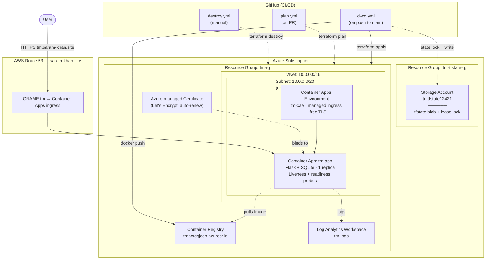

# Architecture

## Infrastructure Diagram



## Scope hierarchy

- **Azure Subscription** — the top-level billing/auth boundary
  - **Resource Group `tm-tfstate-rg`** — bootstrap (out-of-band, not in Terraform state)
    - Storage Account holding the remote tfstate blob and lease lock
  - **Resource Group `tm-rg`** — everything Terraform manages
    - **VNet `tm-vnet`** (`10.0.0.0/16`)
      - **Subnet `container-apps-subnet`** (`10.0.0.0/23`, delegated to `Microsoft.App`)
        - Container Apps Environment `tm-cae`
        - Container App `tm-app`
    - Azure Container Registry `tmacrcgjcdh`
    - Log Analytics Workspace `tm-logs`
    - Azure-managed Certificate (bound to `tm.saram-khan.site`)

## Component Summary

| Component | Purpose |
|---|---|
| **Azure Container Apps** | Serverless container hosting with built-in HTTPS ingress and managed TLS certificate |
| **Azure Container Registry** | Private Docker registry storing the application image |
| **Log Analytics Workspace** | Centralised logging and metrics for the Container Apps environment |
| **Virtual Network / Subnet** | Dedicated network isolation for the Container Apps environment (`/23` required by Azure) |
| **Azure-managed Certificate** | Free Let's Encrypt cert, auto-renewed, scoped to `tm.saram-khan.site` |
| **Terraform Remote State** | Azure Blob Storage backend with native blob-lease locking |
| **GitHub Actions** | Three pipelines: CI/CD (test → build → deploy), Plan (PR), Destroy (manual) |
| **AWS Route 53** | DNS for `saram-khan.site` (separate from the rest of the stack — DNS provider doesn't have to live with the hosting provider) |

## Traffic Flow

```
User → DNS lookup (Route 53) → HTTPS → Container Apps managed ingress → Flask app (port 3000)
```

## Front Door (planned, currently disabled)

The repository contains a fully-implemented Azure Front Door module
(`terraform/modules/frontdoor/`) providing global anycast HTTPS, custom domain
TLS, and HTTP-to-HTTPS redirect. It is **commented out** in the root Terraform
because Azure Front Door is not available on Free Trial subscriptions
(`BadRequest: Free Trial and Student account is forbidden for Azure Frontdoor
resources.`). Uncomment `module.frontdoor` in `terraform/main.tf` after
upgrading to a pay-as-you-go subscription.

## Security Highlights

- ACR admin password stored as a Terraform-managed Container App secret (never written in plaintext)
- Non-root container user (`appuser`) inside the image
- Trivy image scan in CI fails the build on HIGH or CRITICAL CVEs
- Container Apps managed ingress enforces HTTPS only (`allow_insecure_connections = false`)
- Terraform state lives in an access-key-protected blob container, not in version control
- GitHub Actions auth via OIDC federated credentials — no long-lived secrets
- Destroy pipeline requires manual confirmation text to prevent accidents
